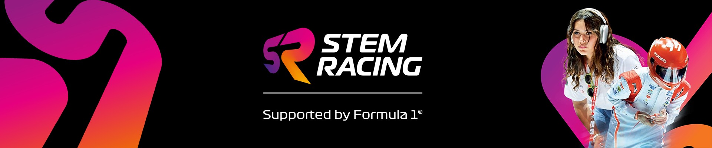
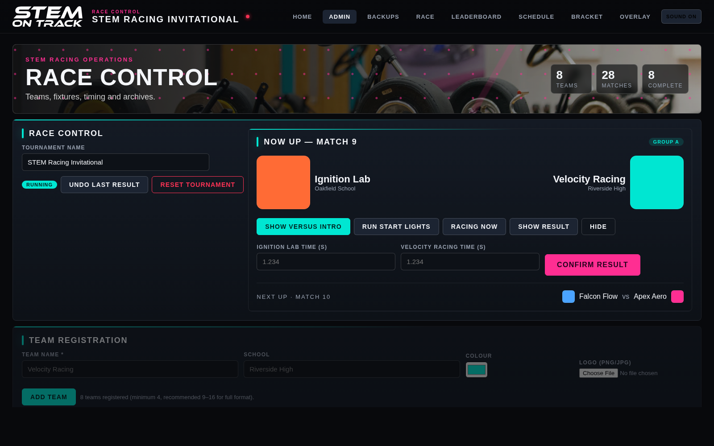
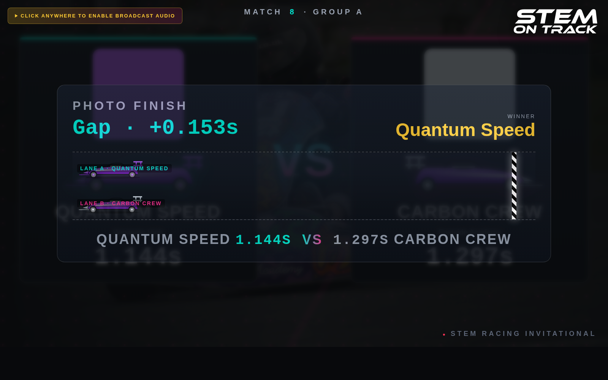
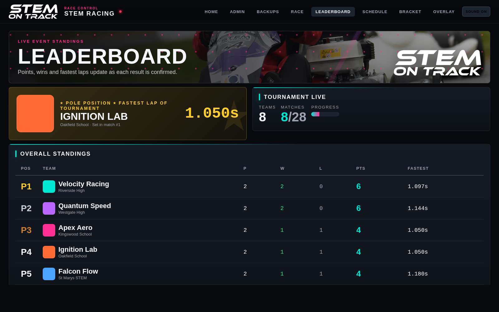
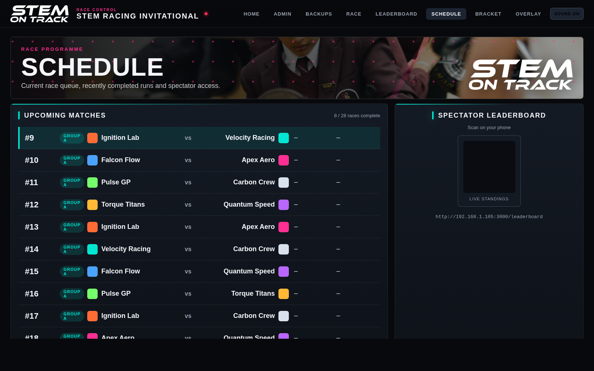
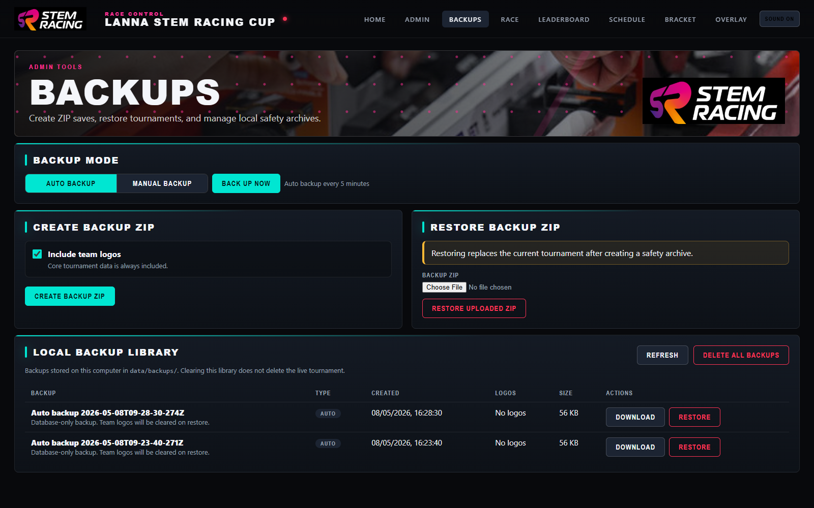

# (unofficial) STEM Racing Tournament Platform



A bespoke local event platform for F1 in Schools / STEM Racing-style head-to-head competitions. It is designed for the reality of school race days: one laptop, a few displays, excited teams, fast timing corrections, and no dependence on the internet.

The platform runs entirely on the organiser's computer and live-synchronises race control, projector screens, standings, fixtures, brackets, OBS overlays, backups, audio cues, and results through a local web server.

This project was created by a teacher who has spent years running and supporting these kinds of events. The aim is to keep the system simple enough for a busy school event while still handling the parts that usually become stressful on race day.

## Screenshots




| Race Screen | Live Leaderboard |
|-------------|------------------|
|  |  |

| Schedule View | Backup Console |
|---------------|----------------|
|  |  |

## Highlights

- **Race control for one-day school events** — register teams, generate fixtures, start races, enter times, undo mistakes, reset safely, and export results from one operator screen.
- **Live displays for the room** — projector race screen, leaderboard, schedule, knockout bracket, OBS overlay, and backup tools all update in real time over WebSockets.
- **F1-inspired presentation** — five-light start sequence, versus intros, colour-matched car liveries, photo-finish animation, podium ceremony, Pole Position award, ticker overlay, and subtle race-day sound cues.
- **Practical tournament management** — automatic schedule generation, group-stage scoring, knockout progression, fastest-lap tracking, CSV/JSON exports, and clear event-state handling.
- **School-friendly resilience** — local SQLite data, downloadable ZIP backups, safe restore with a pre-restore archive, auto/manual local backup modes, and a one-click clear-out for old backup history.
- **Offline by design** — browser-based, local-network ready, and built to keep working even when the venue Wi-Fi or internet is not cooperating.

## Core Features

- **Team registration** with logo upload, school name, and team colour.
- **Automatic schedule generation** using a World Cup-style format adapted for school racing events.
- **Head-to-head scoring** with 3 points for a win and 1 point for a loss.
- **Eight live display/control windows** that stay in sync, plus a spectator menu for public devices:
  - `/admin` — race control for the event operator.
  - `/race` — big TV / projector screen with the five-light start sequence and versus intro.
  - `/leaderboard` — live standings with the Pole Position fastest-lap award.
  - `/schedule` — upcoming matches plus a QR code for spectator screens.
  - `/rotation` — read-only public display that cycles through now-up, schedule, and standings.
  - `/spectator` — public menu with rotation, leaderboard, and schedule options.
  - `/bracket` — live knockout bracket.
  - `/overlay` — transparent OBS browser source for live streaming.
  - `/backups` — backup, restore, auto/manual backup mode, and local backup library.
- **Broadcast production touches**:
  - Synthesised audio for race lights, engine-like cues, crowd moments, UI feedback, backups, errors, and race actions.
  - Stylised F1 car livery SVG per team, tinted to the team colour.
  - Photo-finish animation after each race showing the gap between cars.
  - Championship podium ceremony with 1st/2nd/3rd rising onto plinths, Pole Position trophy, and confetti.
  - OBS overlay with scorebug and live standings ticker.
- **Backups and portability**:
  - Downloadable ZIP backups.
  - Optional inclusion of uploaded team logos.
  - Logo-preserving local backups for auto/manual saves.
  - Safe restore that archives the current tournament before replacing it.
  - Auto backup every 5 minutes or manual-only backup mode.
  - Delete-all backup history button for a clean new session.
- **Modern race-broadcast styling** with a dark interface, teal/magenta accents, native fonts, and no external font dependency.

## Requirements

- **Node.js 18 or newer** — [nodejs.org](https://nodejs.org)
- A modern browser (Chrome, Edge, Firefox, Safari)
- Windows, macOS, or Linux

## Getting started

### Windows

Double-click `start-windows.cmd`, or run:

```cmd
npm install
npm start
```

### macOS / Linux

```bash
chmod +x start.sh
./start.sh
```

### Manual / all platforms

```bash
npm install
npm start
```

Then open **http://localhost:3000** in your browser. The console will also show a spectator LAN address like `http://192.168.x.x:3000/spectator`, which you can open on other devices on the same Wi-Fi.

Admin, backup, export, and race-control actions are local-only by default: use them from `localhost` on the organiser laptop. Devices on the same Wi-Fi are redirected to spectator screens and can only view the rotation display, leaderboard, or schedule.

If you switch Node.js versions and see a native module mismatch, `npm start` now auto-rebuilds `better-sqlite3` before launching.

## Smoke test

```bash
npm test
```

This runs a fast schedule/bracket smoke test over multiple tournament sizes so regressions are easier to catch before an event.

## Running an event — quick guide

1. **Open `/admin`** on the operator laptop (the one running the server).
2. **Register teams** — name, school, colour, logo (PNG / JPG, up to 4 MB).
3. Choose the tournament format if needed, then click **Generate Schedule**. The default remains league plus knockout with a target of 5 races per team where feasible. You can switch to league-only or adjust the target before generating.
   - If you add or remove a team after generating the schedule, the schedule is cleared automatically so you can regenerate a clean bracket.
4. Click **Start Tournament**.
5. **On a second display** (or second browser window on your laptop), open `/race`. Drag it to the projector / big TV and press F11 for full-screen.
6. For one rotating public display, open `/rotation`. On spectator phones/tablets, scan the QR code on `/schedule` or open the LAN `/spectator` link shown in the console.
7. For each race:
   - Click **Show Versus Intro** → big team-vs-team animation on the race screen.
   - When both cars are on the line, click **Run Start Lights** → F1 5-light countdown with a random release.
   - Click **Racing Now** → the big screen clears, ready for the race.
   - After the race, type in each team's time and click **Confirm Result**. Winner is auto-picked from the times. Points are applied and the leaderboard updates live.
   - The next match loads automatically.
   - If the latest result is wrong, **Undo Last Result** still works. To fix an older completed match, use **Correct Result** in the schedule table; the server blocks corrections that would invalidate completed knockout matches.
8. When all group matches finish, the knockout bracket is generated automatically unless league-only mode is selected. QF → SF → Final + 3rd-place match. Winners advance, losers get the 1 consolation point.
9. When the final is done, the race screen switches to a champion takeover with the Pole Position award highlighted.
10. Use **Export CSV** or **Export JSON** at any time to save results.

## Streaming to Twitch / YouTube with OBS

1. Add a **Browser** source in OBS.
2. URL: `http://localhost:3000/overlay`
3. Width: 1920, Height: 1080 (or whatever your canvas is).
4. Tick **Shutdown source when not visible** and **Refresh browser when scene becomes active** if you like.
5. The overlay has a transparent background, so lay it on top of your track camera. The scorebug appears automatically when a match is active, and the standings ticker stays in the top-right throughout the event.

## Audio

The race screen and race-control UI use synthesised audio generated directly in your browser — no audio files, works offline. Browsers block audio until the user interacts with the page, so click once on the race screen before the first start sequence.

Admin and backup pages include subtle button, confirmation, warning, backup/export, and race-action sounds. Use the **Sound on/off** toggle in the top bar to mute or re-enable these effects; the setting is stored locally in the browser.

## Keyboard tips

- **F11** in your browser → full-screen (great for the race screen on a projector)
- **Ctrl + Shift + N / P** → new private window (handy to keep displays isolated)
- In Chrome: right-click a window → **Move to another window** to pop it to a second monitor easily

## Data & files

- `data/tournament.db` — SQLite database (teams, matches, settings, history)
- `data/logos/` — uploaded team logos
- `data/backups/backup-*` — auto/manual local snapshots containing `tournament.db`, a manifest, and uploaded logos; newest 20 kept
- `data/backups/*.db` — older legacy database-only local backups, still listed/restorable
- `data/backups/archive-*` — manual/pre-reset archives containing the DB plus uploaded logos, newest 10 kept
- `/backups` — backup console for ZIP backup download, restore, and local backup library

Backup ZIPs always include `tournament.db`. Tick **Include team logos** to include uploaded team logo files. Any restore creates a safety archive of the current tournament first, then replaces the database with the selected backup.

Use **Auto Backup** on `/backups` to save a local database-and-logos snapshot every 5 minutes, or **Manual Backup** to stop the automatic timer and only save when **Back Up Now** is clicked. The selected mode is saved in the database.

Restoring a database-only backup keeps existing logo files where possible. If the restored database points at logo filenames that are not available, those broken logo links are cleared and the restore response shows a warning.

Use **Delete All Backups** on `/backups` to clear old local backup/archive history before a new event. This only clears `data/backups/`; it does not delete the live tournament database or uploaded logos.

To start a completely fresh event, either use **Reset Tournament** in admin, or stop the server and delete `data/tournament.db`. Reset creates an archive first when possible.

## Tournament format

| Teams | Groups | Group size | Group matches/team | Playoff seeds |
|-------|--------|-----------|-------------------|---------------|
| 4–8   | 1      | 4–8       | 3–7               | Top 4 → SF    |
| 9     | 2      | 5 + 4     | 4, 3 (+ cross-group bonuses to 5) | Top 4 each → QF |
| 10    | 2      | 5 + 5     | 4 each (+ bonus)   | Top 4 each → QF |
| 11    | 2      | 6 + 5     | 5, 4 (+ bonus)     | Top 4 each → QF |
| 12    | 2      | 6 + 6     | 5 each             | Top 4 each → QF |
| 13–16 | 4      | 3–4       | 2–3 (+ cross-group bonuses to 5) | Top 2 each → QF |

Scoring: **win = 3 pts, loss = 1 pt**. Cross-group bonus races count toward each team's own group standing. Tiebreaks: points → wins → fastest lap → team name.

Setup options on `/admin` let the organiser choose **League only** or **League plus knockout** and a target number of races per team before generating the schedule. If the requested target cannot be reached without repeat pairings, the platform creates the fairest unique-pairing schedule it can and shows the resulting range.

## Known edge cases

- **Corrections after knockout starts**: group-stage corrections are blocked once knockout results have completed. Knockout corrections are allowed only while downstream knockout matches are still unresolved.
- **Logos**: stored under `data/logos/`. New local backups and safety archives include logos. Legacy database-only backups preserve existing logo files where possible but cannot recreate files they do not contain.
- **Port**: defaults to `3000`. On macOS/Linux, set `PORT=4000 npm start` to change. On Windows PowerShell, use `$env:PORT=4000; npm start`.
- **Exact ties**: the server rejects identical lane times, so if a race is truly tied you should rerun it or enter a more precise measurement.

## Enhancement ideas for later

- Hardware timing-gate integration (read times from a timing light over serial)
- DNF / DSQ buttons on race control (currently you'd just leave a time blank)
- Announcer / commentator screen with auto-generated talking points
- Timing-gate calibration and diagnostics screen

---

Made with Node.js + Express + Socket.IO + SQLite. No cloud, no telemetry, no accounts — just a local server on your laptop.
